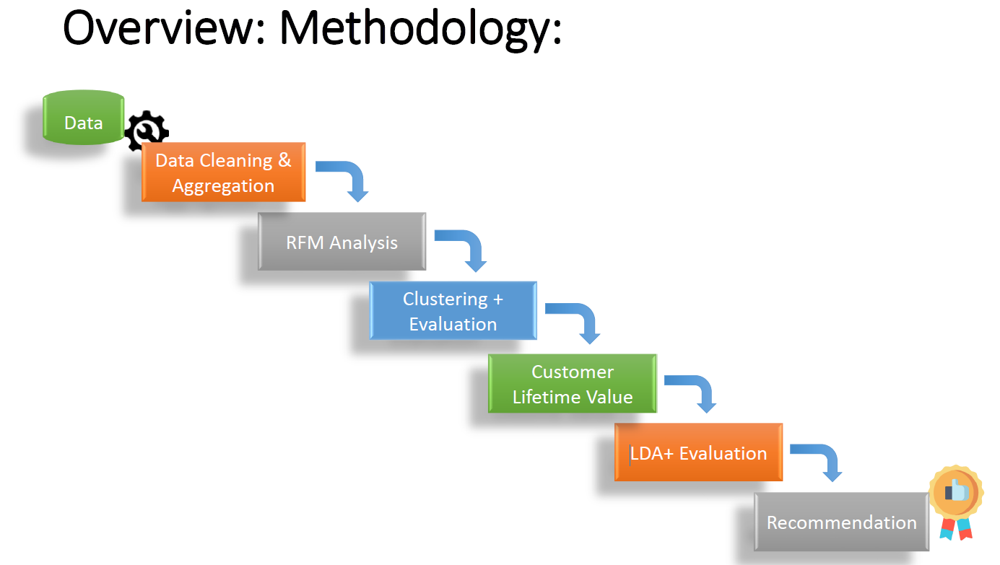
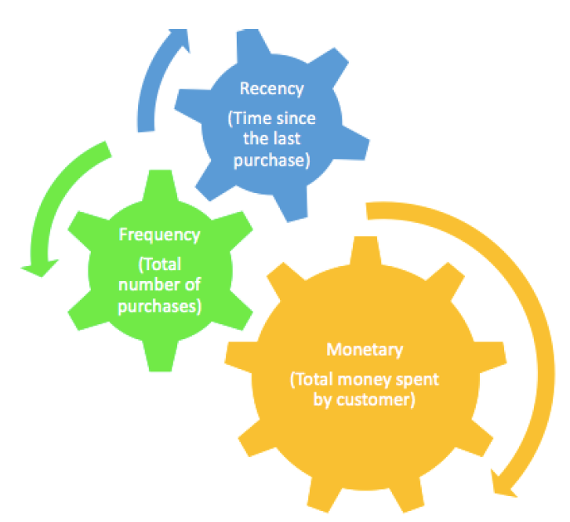
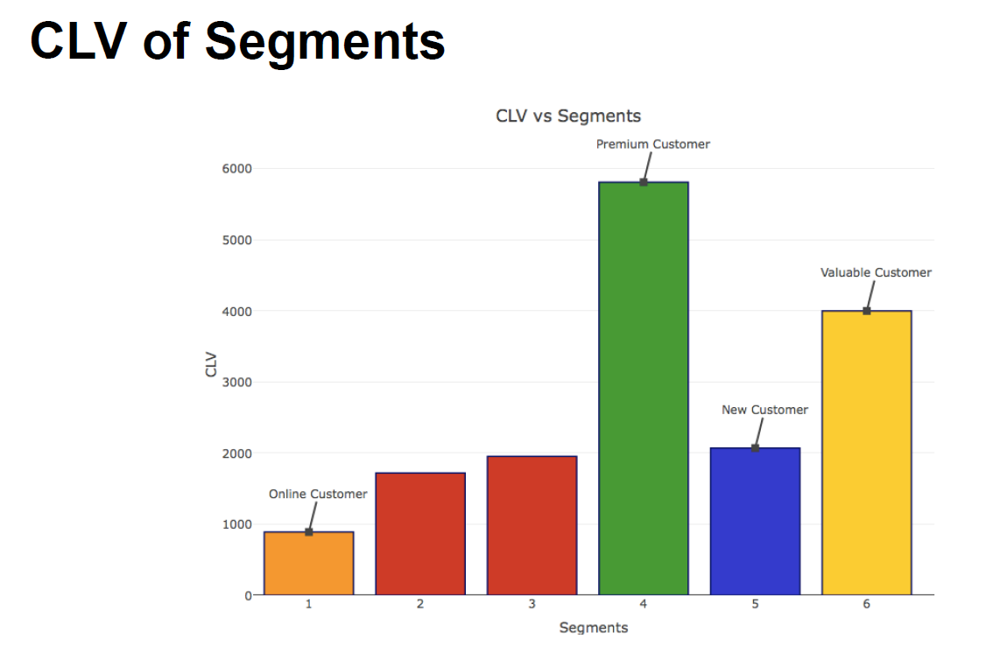
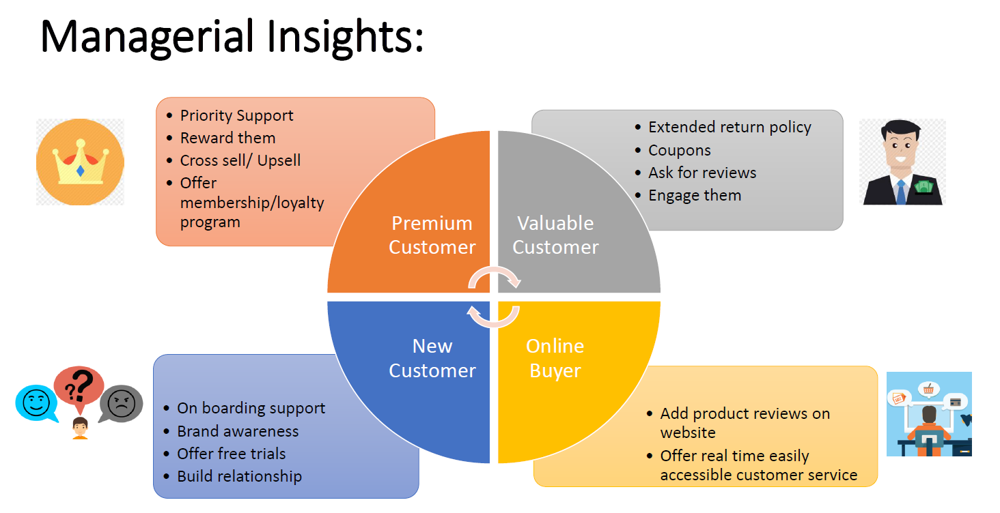

# Marketing Analytics - Customer Segmentation

## Summary

* Objective: To identify our best and valuable customers and develop marketing strategies to retain them and invest in the right customer category to increase company profits

### Approach: 

	* Customer segmentation
	* Customer Lifetime value
	* Targeting customers 

### Approach for customer segmentation

* We used “Behavior based segmentation” to segment our customers.
* We segmented the customers based on RFM analysis.

* RFM analysis is a behavioral based segmentation technique that uses pastpurchase behavior to dividecustomers into groups to determine quantitatively which customers are the best ones by examining:
	* how recently a customer has purchased (Recency)
	* how often they purchase (Frequency)
	* how much the customer spends (Monetary)

### Which customers to target?

* We used Linear discriminant analysis to target our customers using demographic variables.
* We have also created some new variables to build customer
profile:
	* Num of online transactions
	* Num of returns
	* Num of different categories purchased
	* Num of stores visited

### Is every customer driving equal amount of profit for our company? What value does each customer brings to the company?

### What is customer lifetime value?

* Customer Lifetime Value is the projected revenue that a customerwill generate during their lifetime.
* Using CLV, a company can derive actionable information that enables managers to design strategies for customers that matter in the long-run rather than focusing solely on increasing short-term profits.

